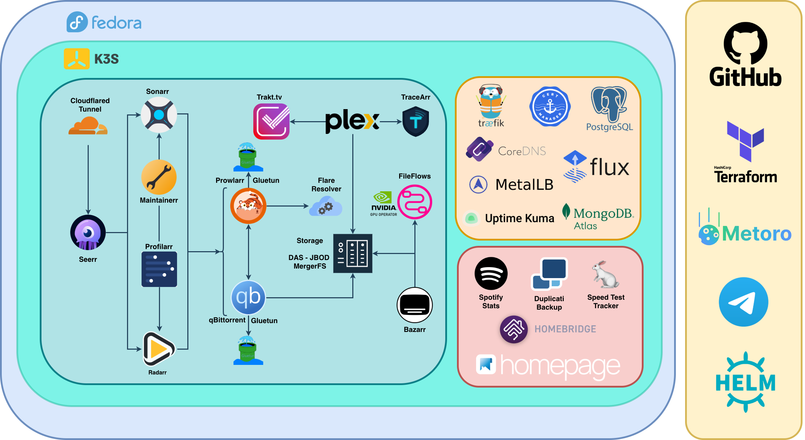

# K3s Homelab Infrastructure

A production-grade home media server and automation platform built with Infrastructure as Code principles, leveraging Kubernetes, GitOps, and modern DevOps practices.

## 🎯 Project Overview

This repository demonstrates a complete infrastructure-as-code implementation for a self-hosted media server environment. It showcases automated provisioning, declarative configuration management, and GitOps workflows using industry-standard tools.

## 🏗️ Architecture

### Infrastructure Layer
- **K3s Cluster**: Lightweight Kubernetes distribution optimized for edge computing
- **Terraform**: Infrastructure provisioning and configuration management
- **DAS - JBOD (MergerFS) Storage**: Centralized persistent storage for media and application data
- **MetalLB**: Bare-metal load balancer for service exposure
- **Traefik**: Cloud-native ingress controller with automatic HTTPS

### GitOps Layer
- **FluxCD**: Continuous delivery and automated deployments
- **GitHub App Authentication**: Secure repository access
- **SOPS + Age**: Encrypted secrets management
- **Gateway API**: Next-generation ingress specification

## 🚀 Deployed Services

## Infrastructure & Networking

-  **[cert-manager](https://cert-manager.io/)**: X.509 certificate management for Kubernetes
-  **[uptime-kuma](https://github.com/louislam/uptime-kuma)**: Self-hosted uptime monitoring tool
-  **[flux](https://fluxcd.io/)**: GitOps continuous delivery for Kubernetes
-  **[homebridge](https://homebridge.io/)**: HomeKit support for smart home devices
-  **[coredns](https://coredns.io)**:  Core DNS service
-  **[metrics-server](https://github.com/kubernetes-sigs/metrics-server)**: Kubernetes resource metrics aggregator
-   **[metoro-exporter](https://metoro.io/)**: Platform for Observability
-  **[cloudflared](https://github.com/cloudflare/cloudflared)**: Cloudflare Tunnel client
-  **[duplicati](https://www.duplicati.com/)**: Encrypted backup solution
-  **[metallb](https://metallb.universe.tf/)**: Load balancer for bare metal Kubernetes
-  **[traefik](https://traefik.io/)**: Cloud-native reverse proxy and load balancer

## Media Management

-  **[bazarr](https://www.bazarr.media/)**: Subtitle management for Sonarr and Radarr
-  **[fileflows](https://fileflows.com/)**: File processing and automation workflows
-  **[flaresolverr](https://github.com/FlareSolverr/FlareSolverr)**: Proxy server to bypass Cloudflare protection
-  **[homepage](https://gethomepage.dev/)**: Customizable application dashboard
-  **[jellyseerr](https://github.com/Fallenbagel/jellyseerr)**: Media request management for Jellyfin/Plex
-  **[PlexTraktSync](https://github.com/Taxel/PlexTraktSync)**: Sync Plex views to Trakt.tv
-  **[plex-media-server](https://www.plex.tv/)**: Media server and streaming platform
-  **[profilarr](https://github.com/Dictionarry-Hub/profilarr)**: Profile management for Sonarr/Radarr
-  **[prowlarr](https://prowlarr.com/)**: Indexer manager for *arr applications
-  **[qbittorrent](https://www.qbittorrent.org/)**: BitTorrent client
-  **[radarr](https://radarr.video/)**: Movie collection manager
-  **[sonarr](https://sonarr.tv/)**: TV series collection manager
-  **[sonarr-animeworld](https://github.com/MainKronos/Sonarr-AnimeDownloader)**: TV series collection manager specific for anime
-  **[tautulli](https://tautulli.com/)**: Plex analytics and monitoring

## Gaming
-  **[RomM](https://romm.app)**: Rom Manager and Player 
-  **[Playerr](https://github.com/Maikboarder/Playerr)**: Arr Stack for gaming

## Utilities

- 🐇 **[speedtest-tracker](https://github.com/alexjustesen/speedtest-tracker)**: Network speed monitoring and tracking
-  **[Your Spotify](https://github.com/Yooooomi/your_spotify)**: Self hosted Spotify tracking dashboard
## 📋 Key Features

### Infrastructure as Code
- Fully automated cluster provisioning
- Remote execution for initial setup
- Version-controlled infrastructure state

### GitOps Workflow
- Automated deployments via FluxCD
- Git as single source of truth
- Encrypted secrets in repository
- Self-healing cluster state

### Security Best Practices
- SSH key-based authentication
- Encrypted secrets management (SOPS + Age)
- GitHub App authentication (no personal tokens)
- SELinux context management
- Least privilege access patterns

### Scalability & Reliability
- Managed Kubernetes fields (labels, taints)
- Automated backup schedules
- Health monitoring and analytics

## 🔐 Security Considerations

This is a homelab environment with appropriate security measures:
- Private network deployment
- Encrypted secrets in repository
- No hardcoded credentials
- SSH key authentication
- SELinux enforcement
- Regular automated backups

## 🤝 Contributing

This is a personal homelab project showcasing infrastructure skills. Feel free to use it as inspiration for your own setup!

## 📄 License

MIT License - feel free to use and adapt for your own projects.

---

**Note**: This repository demonstrates production-ready practices in a homelab context. Sensitive values are managed via environment variables and encrypted secrets, never committed in plain text.
