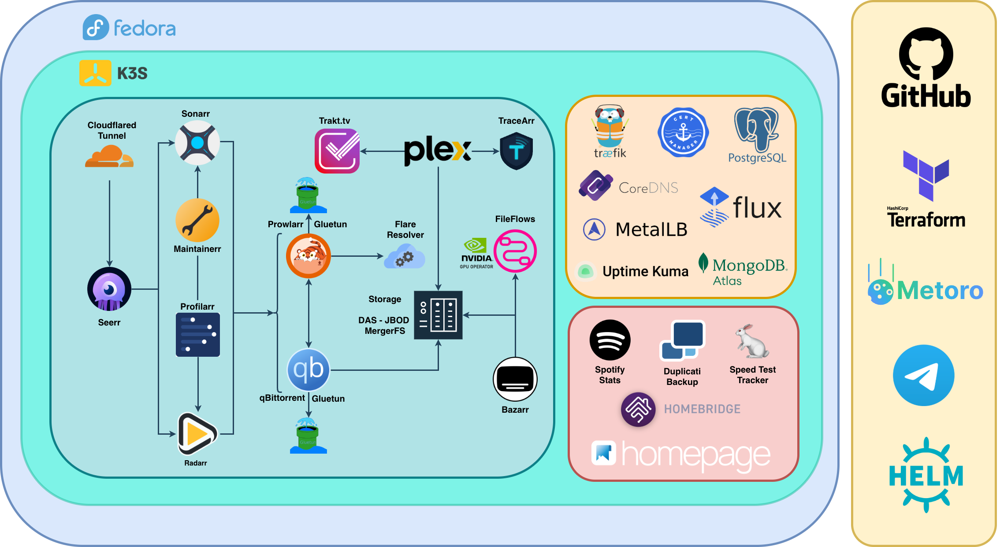

# K3s Homelab Infrastructure

A production-grade home media server and automation platform built with Infrastructure as Code principles, leveraging Kubernetes, GitOps, and modern DevOps practices.

## 🎯 Project Overview

This repository demonstrates a complete infrastructure-as-code implementation for a self-hosted media server environment. It showcases automated provisioning, declarative configuration management, and GitOps workflows using industry-standard tools.

## 🏗️ Architecture

### Infrastructure Layer
- **K3s Cluster**: Lightweight Kubernetes distribution optimized for edge computing
- **Terraform**: Infrastructure provisioning and configuration management
- **DAS - JBOD (MergerFS) Storage**: Centralized persistent storage for media and application data
- **MetalLB**: Bare-metal load balancer for service exposure
- **Traefik**: Cloud-native ingress controller with automatic HTTPS

### GitOps Layer
- **FluxCD**: Continuous delivery and automated deployments
- **GitHub App Authentication**: Secure repository access
- **SOPS + Age**: Encrypted secrets management
- **Gateway API**: Next-generation ingress specification

## 🚀 Deployed Services

## Infrastructure & Networking

<table>
<tr><td></td><td><b><a href="https://cert-manager.io/">cert-manager</a></b></td><td>X.509 certificate management for Kubernetes</td></tr>
<tr><td></td><td><b><a href="https://github.com/louislam/uptime-kuma">uptime-kuma</a></b></td><td>Self-hosted uptime monitoring tool</td></tr>
<tr><td></td><td><b><a href="https://fluxcd.io/">flux</a></b></td><td>GitOps continuous delivery for Kubernetes</td></tr>
<tr><td></td><td><b><a href="https://homebridge.io/">homebridge</a></b></td><td>HomeKit support for smart home devices</td></tr>
<tr><td></td><td><b><a href="https://coredns.io">coredns</a></b></td><td>Core DNS service</td></tr>
<tr><td></td><td><b><a href="https://github.com/kubernetes-sigs/metrics-server">metrics-server</a></b></td><td>Kubernetes resource metrics aggregator</td></tr>
<tr><td></td><td><b><a href="https://metoro.io/">metoro-exporter</a></b></td><td>Platform for Observability</td></tr>
<tr><td></td><td><b><a href="https://github.com/cloudflare/cloudflared">cloudflared</a></b></td><td>Cloudflare Tunnel client</td></tr>
<tr><td></td><td><b><a href="https://www.duplicati.com/">duplicati</a></b></td><td>Encrypted backup solution</td></tr>
<tr><td></td><td><b><a href="https://metallb.universe.tf/">metallb</a></b></td><td>Load balancer for bare metal Kubernetes</td></tr>
<tr><td></td><td><b><a href="https://traefik.io/">traefik</a></b></td><td>Cloud-native reverse proxy and load balancer</td></tr>
<tr><td></td><td><b><a href="https://pi-hole.net">pihole</a></b></td><td>Network AD Blocker</td></tr>
<tr><td></td><td><b><a href="https://github.com/AnalogJ/scrutiny">Scrutiny</a></b></td><td>Hard Drive Check Tools</td></tr>
<tr><td></td><td><b><a href="https://github.com/DartSteven/Nutify">Nutify</a></b></td><td>UPS Monitoring Tool</td></tr>
</table>

## Media Management

<table>
<tr><td></td><td><b><a href="https://www.bazarr.media/">bazarr</a></b></td><td>Subtitle management for Sonarr and Radarr</td></tr>
<tr><td></td><td><b><a href="https://fileflows.com/">fileflows</a></b></td><td>File processing and automation workflows</td></tr>
<tr><td></td><td><b><a href="https://github.com/nvidia/gpu-operator">nvidia</a></b></td><td>Nvidia GPU Operator</td></tr>
<tr><td></td><td><b><a href="https://github.com/FlareSolverr/FlareSolverr">flaresolverr</a></b></td><td>Proxy server to bypass Cloudflare protection</td></tr>
<tr><td></td><td><b><a href="https://gethomepage.dev/">homepage</a></b></td><td>Customizable application dashboard</td></tr>
<tr><td></td><td><b><a href="https://github.com/seerr-team/seerr">seerr</a></b></td><td>Media request management for Jellyfin/Plex</td></tr>
<tr><td></td><td><b><a href="https://github.com/Taxel/PlexTraktSync">PlexTraktSync</a></b></td><td>Sync Plex views to Trakt.tv</td></tr>
<tr><td></td><td><b><a href="https://www.plex.tv/">plex-media-server</a></b></td><td>Media server and streaming platform</td></tr>
<tr><td></td><td><b><a href="https://github.com/Dictionarry-Hub/profilarr">profilarr</a></b></td><td>Profile management for Sonarr/Radarr</td></tr>
<tr><td></td><td><b><a href="https://prowlarr.com/">prowlarr</a></b></td><td>Indexer manager for *arr applications</td></tr>
<tr><td></td><td><b><a href="https://www.qbittorrent.org/">qbittorrent</a></b></td><td>BitTorrent client</td></tr>
<tr><td></td><td><b><a href="https://radarr.video/">radarr</a></b></td><td>Movie collection manager</td></tr>
<tr><td></td><td><b><a href="https://maintainerr.info">maintainerr</a></b></td><td>Media collection maintainer</td></tr>
<tr><td></td><td><b><a href="https://sonarr.tv/">sonarr</a></b></td><td>TV series collection manager</td></tr>
<tr><td></td><td><b><a href="https://github.com/MainKronos/Sonarr-AnimeDownloader">sonarr-animeworld</a></b></td><td>TV series collection manager specific for anime</td></tr>
<tr><td></td><td><b><a href="https://github.com/connorgallopo/Tracearr/tree/main">tracearr</a></b></td><td>Plex analytics and monitoring</td></tr>
<tr><td></td><td><b><a href="https://github.com/lingarr-translate/lingarr">Lingarr</a></b></td><td>SRT subtitle translation</td></tr>
<tr><td></td><td><b><a href="https://github.com/dispatcharr/dispatcharr">Dispatcharr</a></b></td><td>DVR manager</td></tr>
<tr><td></td><td><b><a href="https://github.com/qdm12/gluetun">gluetun</a></b></td><td>VPN Client</td></tr>
</table>

## Gaming

<table>
<tr><td></td><td><b><a href="https://romm.app">bazarr</a></b></td><td>Rom Manager and Player </td></tr>
<tr><td></td><td><b><a href="https://github.com/Doezer/Questarr">QuestArr</a></b></td><td>Arr Stack for gaming</td></tr>
</table>

## Utilities

<table>
<tr><td>🐇</td><td><b><a href="https://github.com/alexjustesen/speedtest-tracker">speedtest-tracker</a></b></td><td>Network speed monitoring and tracking</td></tr>
<tr><td></td><td><b><a href="https://github.com/Yooooomi/your_spotify">Your Spotify</a></b></td><td>Self hosted Spotify tracking dashboard</td></tr>
<tr><td></td><td><b><a href="https://filebrowserquantum.com/en/">FileBrowser Quantum</a></b></td><td>File Browser</td></tr>
</table>

## 📋 Key Features

### Infrastructure as Code
- Fully automated cluster provisioning
- Remote execution for initial setup
- Version-controlled infrastructure state

### GitOps Workflow
- Automated deployments via FluxCD
- Git as single source of truth
- Encrypted secrets in repository
- Self-healing cluster state

### Security Best Practices
- SSH key-based authentication
- Encrypted secrets management (SOPS + Age)
- GitHub App authentication (no personal tokens)
- SELinux context management
- Least privilege access patterns

### Scalability & Reliability
- Managed Kubernetes fields (labels, taints)
- Automated backup schedules
- Health monitoring and analytics

## 🔐 Security Considerations

This is a homelab environment with appropriate security measures:
- Private network deployment
- Encrypted secrets in repository
- No hardcoded credentials
- SSH key authentication
- SELinux enforcement
- Regular automated backups

## 🤝 Contributing

This is a personal homelab project showcasing infrastructure skills. Feel free to use it as inspiration for your own setup!

## 📄 License

MIT License - feel free to use and adapt for your own projects.

---

**Note**: This repository demonstrates production-ready practices in a homelab context. Sensitive values are managed via environment variables and encrypted secrets, never committed in plain text.
